  

 

> **Xin chào!** Mình là Đức Anh (a.k.a. **Katmin / Kenzy**), dev ở Việt Nam. Ban ngày viết Java & Spring Boot, ban đêm vọc AI, làm tiện ích Chrome và mấy con game nhỏ cho vui.

 

 

  
  
  
  

  <b>Side quests:</b>
  <a href="https://github.com/katmin2001/rpa-extractor">rpa-extractor</a> ·
  <a href="https://github.com/katmin2001/odoo-library-module">odoo-library-module</a> ·
  <a href="https://github.com/katmin2001/code_PTIT">code_PTIT</a> ·
  <a href="https://github.com/katmin2001?tab=repositories">…and more</a>

 

 

  
  
  

 

Every panel is drawn by <a href="scripts/build.mjs"><code>scripts/build.mjs</code></a> and redrawn daily by GitHub Actions.

